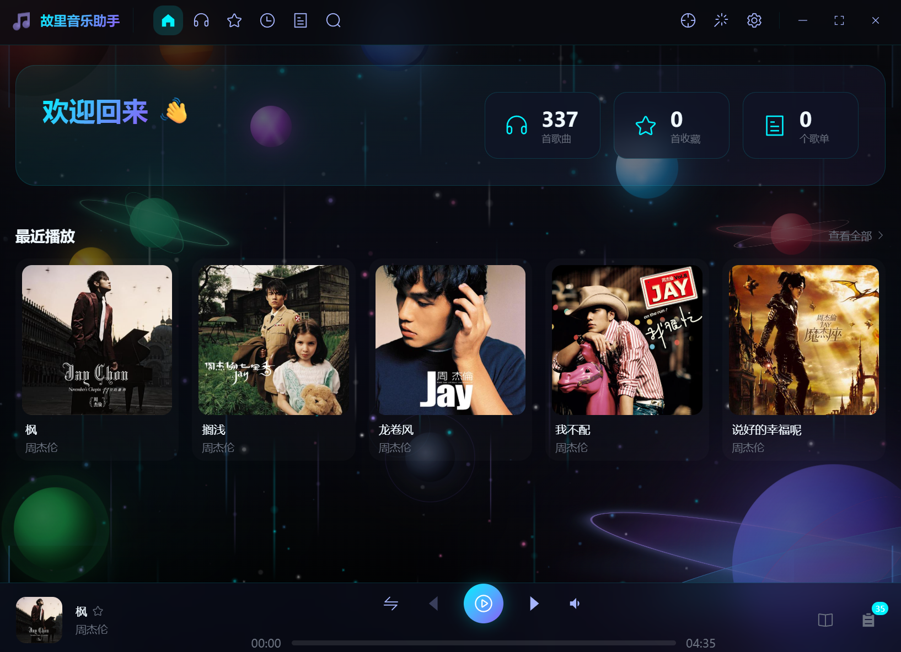

<h1 align="center">🎵 故里音乐助手</h1>

<p align="center">
  
</p>

<p align="center">
  <a href="https://vuejs.org/">
    
  </a>
  <a href="https://www.typescriptlang.org/">
    
  </a>
  <a href="https://www.electronjs.org/">
    
  </a>
  <a href="LICENSE">
    
  </a>
</p>

**本地音乐管理系统**

基于 Electron + Vue 3 + TypeScript + Vite + Element Plus + SQLite 构建的现代化桌面音乐播放器

---
<p align="center">
  
</p>

---

## 功能特性

### 核心功能

| 功能             | 描述                                                                 |
| :--------------- | :------------------------------------------------------------------- |
| **本地音乐管理** | 扫描本地音乐文件夹，自动解析音频元数据（标题、艺术家、专辑、封面等） |
| **歌单管理**     | 创建、编辑、删除歌单，自由管理您的音乐收藏                           |
| **收藏功能**     | 快速收藏喜欢的歌曲，一键访问我喜欢                                   |
| **歌词显示**     | 支持 LRC 格式歌词同步滚动，沉浸式歌词页面                            |
| **最近播放**     | 智能记录播放历史，快速回顾听歌记录                                   |

### 界面与体验

| 功能             | 描述                                           |
| :--------------- | :--------------------------------------------- |
| **多主题切换**   | 炫酷的暗色主题、玻璃拟态效果，多种动态背景可选 |
| **快捷主题切换** | 标题栏一键切换两款预设主题                     |
| **迷你播放器**   | 小窗口模式，支持拖拽移动，轻量化使用           |
| **多语言支持**   | 支持中文、英文、法语、俄语、西班牙语、阿拉伯语 |
| **播放队列**     | 可视化播放队列，支持拖拽排序                   |

### 性能与效率

| 功能           | 描述                                         |
| :------------- | :------------------------------------------- |
| **全局快捷键** | 支持媒体键控制播放（上一曲/下一曲/播放暂停） |
| **离线运行**   | 完全本地化，无需联网，隐私安全               |
| **便携模式**   | 数据存储于应用目录，U盘即装即用              |
| **高性能渲染** | 大型音乐库毫秒级加载，渐进式渲染技术         |

---

## 国际化

支持以下语言：

| 语言     |  代码   |  状态   |
| :------- | :-----: | :-----: |
| 简体中文 | `zh-CN` | ✅ 完整 |
| English  | `en-US` | ✅ 完整 |
| Français | `fr-FR` | ✅ 完整 |
| Русский  | `ru-RU` | ✅ 完整 |
| Español  | `es-ES` | ✅ 完整 |
| العربية  | `ar-SA` | ✅ 完整 |

---

## 快速开始

### 环境要求

| 依赖         | 版本要求                         |
| :----------- | :------------------------------- |
| **Node.js**  | >= 20.0.0                        |
| **npm**      | >= 10.0.0                        |
| **操作系统** | Windows 10+, macOS 10.15+, Linux |

### 安装与运行

```bash
# 克隆项目
git clone https://github.com/yeflyleaf/Guli_MusicAttendant.git
cd Guli_MusicAttendant/Frontend

# 安装依赖
npm install

# 开发模式运行
npm run dev

# 构建生产版本
npm run build

# 打包安装程序
npm run build:win    # Windows
npm run build:mac    # macOS
npm run build:linux  # Linux
```

---

## 项目结构

```text
Guli_MusicAttendant/
├── Frontend/                              # 前端 Electron 应用
│   ├── src/
│   │   ├── main/                          # Electron 主进程
│   │   │   ├── index.ts                   # 主进程入口
│   │   │   ├── db/                        # SQLite 数据库层 (Schema, Repos)
│   │   │   ├── ipc/                       # IPC 通信处理 (Renderer <-> Main)
│   │   │   ├── services/                  # 业务逻辑服务 (扫描, 窗口, 托盘等)
│   │   │   └── utils/                     # 工具函数
│   │   │
│   │   ├── preload/                       # 🔐 预加载脚本 (Context Bridge)
│   │   │
│   │   └── renderer/                      # 🎨 Vue 渲染进程
│   │       ├── src/
│   │       │   ├── main.ts                # Vue 入口
│   │       │   ├── App.vue                # 根组件
│   │       │   ├── components/            # UI 组件 (Base, Layout, Theme 等)
│   │       │   ├── views/                 # 页面视图 (Home, LocalMusic, Settings 等)
│   │       │   ├── store/                 # Pinia 状态管理
│   │       │   ├── router/                # 路由配置
│   │       │   ├── hooks/                 # Vue Composables
│   │       │   ├── locales/               # i18n 国际化语言包
│   │       │   └── utils/                 # 前端工具函数
│   │       └── index.html                 # HTML 模板
│   │
│   ├── build/                             # 构建资源
│   ├── electron.vite.config.ts            # Vite 配置
│   └── package.json                       # 项目依赖
│
├── .gitignore
├── LICENSE
└── README.md
```

---

## 性能优化

本项目针对大型音乐库场景进行了深度性能优化，确保在管理数千首歌曲时依然保持流畅体验：

| 优化策略           | 描述                                                                |
| :----------------- | :------------------------------------------------------------------ |
| **并行数据预加载** | 在应用启动前并行加载设置和音乐库数据，充分利用初始化阶段的空闲时间  |
| **启动屏缓冲**     | 精美的启动动画作为数据加载缓冲期，优化用户感知的启动速度            |
| **渐进式渲染**     | 首屏仅渲染 20 条数据，利用 `requestAnimationFrame` 异步补全剩余数据 |
| **视图层持久化**   | 使用 `<keep-alive>` 缓存页面组件，实现零开销的页面切回              |
| **GPU 硬件加速**   | 显式启用 GPU 加速，将图形渲染任务卸载至 GPU                         |
| **帧率节流**       | 音频可视化限制在 30 FPS，在保持流畅度的同时减少 50% CPU 占用        |

---

## 📄 许可证 (License)

本项目采用 [AGPL-3.0](LICENSE) 许可证。

Copyright © 2026-Present [yeflyleaf](https://github.com/yeflyleaf). All Rights Reserved.
